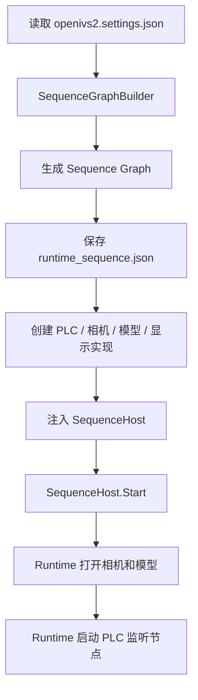
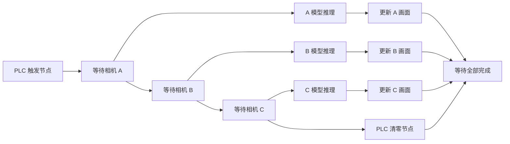
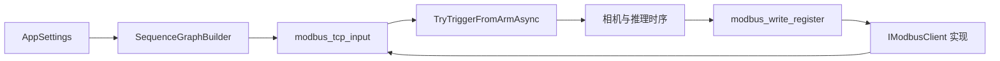

# OpenIVS 2026 Sequence Runtime 扩展开发者指南

本文说明 OpenIVS 2026、Sequence Runtime 和外部设备之间的关系，以及如何增加新的 PLC、相机、模型执行方式或业务节点。源码项目名和命名空间仍为 `OpenIVS2`。

本文只讨论以下生产流程：

```text
PLC 触发 → 清理上周期画面 → 相机取图 → 模型推理 → 更新画面 → PLC 清零/应答
```

移动、回零和运动控制不在本项目范围内。

## 0. 先理解一条主链路

OpenIVS 2026 的核心不是 `MainWindow`，而是 Sequence Runtime。

```text
WPF 前端
  ↓ 配置并生成时序
Sequence Runtime
  ↓ 调用注入的实现
PLC / 相机 / 模型 / 画面
```

各层职责如下：

| 层 | 负责什么 | 不负责什么 |
| --- | --- | --- |
| WPF 前端 | 配置、生成时序、注入实现、展示结果、保存图片和日志 | 不应自己实现生产时序 |
| Sequence Runtime | 节点执行、数据传递、并行、触发去重、取消和资源生命周期 | 不关心具体 PLC 或相机品牌 |
| 设备客户端 | 真正访问 PLC、相机和模型 | 不直接操作 WPF，不直接修改生产统计 |
| Sequence Node | 把设备能力放进生产流程 | 不保存界面状态 |

一句话记忆：

```text
Sequence Runtime 决定什么时候做，注入的客户端决定具体怎么做，WPF 负责配置和展示。
```

### 0.1 软件启动链路



`MainWindow` 是组合入口。它创建并注入以下实现：

```text
ICameraResourceFactory  → OpenIVS 相机
IAiFlowRunner           → DLCV 模型
IModbusClient           → Modbus PLC
IDisplaySink            → WPF ImageViewer
```

### 0.2 一个生产周期的链路

以三台相机为例：



关键语义：

- A 完成取图后，A 开始推理，同时 B 开始等待画面。
- 最后一台相机完成取图后，PLC 清零可以和模型推理并行。
- 所有相机画面更新和 PLC 清零完成后，一个周期才结束。
- Runtime 负责拒绝并发周期，WPF 不直接增加生产计数。
- 周期完成后，WPF 才负责统计、存图、生产 CSV 和运行日志。

### 0.3 增加新功能的统一方式

无论新增 PLC、扫码枪、MES、相机或其他业务步骤，都优先按照下面的顺序：

```text
1. 实现设备客户端
2. 实现或复用 Sequence Node
3. 注册 Sequence Node
4. SequenceGraphBuilder 根据配置生成节点和连线
5. WPF 创建并注入客户端
6. Runtime 执行生产流程
7. WPF 接收状态和最终结果
```

不要在 `MainWindow` 中继续堆叠新的设备轮询线程或生产判断。

## 1. 开发前先判断协议类型

不要看到“PLC”就直接实现 `IModbusClient`。先确认新协议的数据模型。

### 1.1 可以复用 `IModbusClient` 的情况

满足以下条件时，可以沿用现有寄存器模型：

- 触发信号能表示成一个 `ushort` 值。
- 地址能表示成 `ushort` 寄存器地址。
- 周期完成后通过写入一个 `ushort` 值完成清零或应答。
- 支持读取单个或连续多个 Holding Register。

典型情况：

- Modbus RTU。
- Modbus TCP 的不同厂商网关。
- 与 Modbus 寄存器语义完全一致的厂商私有协议。

这类扩展工作量最小，推荐复用：

```text
IModbusClient
modbus_tcp_input
modbus_write_register
RisingEdgeTracker
```

### 1.2 不应复用 `IModbusClient` 的情况

存在以下情况时，应新增协议专用客户端和时序节点：

- 地址是字符串，例如 `DB1.DBW20`、`ns=2;s=PhotoTrigger`。
- 触发值不是 `ushort`，而是 `bool`、Tag、事件或结构体。
- 清零方式不是写回同一个寄存器。
- 协议使用订阅回调，不适合轮询。
- 需要厂商会话、订阅句柄或认证上下文。

典型情况：

- 欧姆龙 FINS/TCP 或 FINS/UDP。
- OPC UA。
- Siemens S7 原生协议。
- EtherNet/IP Tag。
- PLC 主动推送的自定义 TCP 报文。

不要为了少改几个文件，把字符串地址强行转换成 `ushort`。这会让配置、日志和排查信息失真。

## 2. PLC 在 Sequence Runtime 中的位置

新增 PLC 时，应先决定它能否复用现有 Sequence Node，而不是先修改界面按钮。

### 2.1 Modbus 路径

当前 Modbus TCP 路径如下：



职责关系：

```text
modbus_tcp_input       → 监听触发信号并进入 Runtime
IModbusClient          → 连接、读取和写入寄存器
modbus_write_register  → 在时序指定位置清零或写值
TryTriggerFromArmAsync → 防止两个周期同时运行
```

如果欧姆龙或其他 PLC 使用标准 Modbus TCP/RTU，通常只需要复用或替换 `IModbusClient`，生产时序不用改变。

### 2.2 非 Modbus 路径

如果使用 FINS、OPC UA、EtherNet/IP Tag 或厂商推送协议，应新增专用客户端和 Sequence Node：

```text
协议客户端
  ↑
协议输入节点 → Sequence Runtime → 协议清零/应答节点
```

例如欧姆龙 FINS：

```text
OmronFinsClient
OmronFinsInputNode
OmronFinsAcknowledgeNode
```

WPF 只增加配置、客户端创建和状态展示。PLC 监听、触发和应答仍由 Sequence Runtime 控制。

### 2.3 现有模式

| `PlcMode` | 客户端 | 触发入口 | 监听位置 |
| --- | --- | --- | --- |
| `mock` | `MockModbusClient` | `manual_trigger` | 手动或测试注入 |
| `tcp` | `TcpModbusClient` | `modbus_tcp_input` | 时序引擎后台轮询 |
| `serial` | `SerialModbusClient` | `manual_trigger` | `MainWindow.StartPlcPolling()`（旧边界） |

Modbus TCP 已经按照“Sequence Node 监听 PLC”的方式运行。串口 Modbus 仍由 `MainWindow` 轮询后调用 `SequenceHost.TriggerAsync()`，属于尚未统一的旧边界。

以后增加新的 PLC 类型，应优先走 Sequence Runtime 触发节点，不要继续复制 `StartPlcPolling()`。

OpenIVS2 正常启动后会直接开始运行。开始、停止和单次触发位于设置窗口，主界面只保留设置入口；打开设置不会自动停止当前检测任务。

关键文件：

| 责任 | 文件 |
| --- | --- |
| PLC 配置模型 | `OpenIVS2/Models/AppSettings.cs` |
| 设置界面 | `OpenIVS2/SettingsWindow.xaml` |
| 设置加载、保存和校验 | `OpenIVS2/SettingsWindow.xaml.cs` |
| 运行时客户端选择 | `OpenIVS2/MainWindow.xaml.cs` |
| 生产时序生成 | `OpenIVS2/Services/SequenceGraphBuilder.cs` |
| PLC 客户端接口 | `DlcvCsharpApi/sequence/RuntimeInterfaces.cs` |
| PLC 监听与写回节点 | `DlcvCsharpApi/sequence/Nodes/BuiltinNodes.cs` |
| 时序节点注册 | `DefaultNodeFactory.CreateDefault()` |
| 时序测试 | `Test/DlcvSequenceTest/Program.cs` |
| 应用自动验收 | `OpenIVS2/Acceptance/AcceptanceRunner.cs` |

## 3. 推荐实现边界

新增 PLC 类型时，至少需要处理五个边界：

1. 配置能够保存、加载、克隆和校验。
2. 客户端能够连接、读取触发、写清零并安全关闭。
3. 监听任务不能阻塞软件启动，也不能阻塞软件关闭。
4. 一个 PLC 上升沿只能统计一个检测周期。
5. 断线和恢复必须更新状态，但不能按轮询频率刷日志。

## 4. 方案 A：新增 Modbus 兼容类型

假设新增模式名为 `vendor_modbus`，协议仍然是寄存器读写语义。

### 4.1 扩展配置模型

修改 `OpenIVS2/Models/AppSettings.cs`。

根据协议增加必要字段，例如：

```csharp
public string VendorHost { get; set; }
public int VendorPort { get; set; }
public string VendorStation { get; set; }
```

每个新字段必须同步处理：

- `CreateDefault()`：提供可靠默认值。
- `Clone()`：复制到设置窗口的工作副本。
- `Normalize()`：修复空值和越界值。
- `SettingsService` 的 JSON 往返测试。

不要只添加属性而忘记 `Clone()`。否则设置界面中修改的值可能丢失。

### 4.2 增加设置界面

修改：

- `OpenIVS2/SettingsWindow.xaml`
- `OpenIVS2/SettingsWindow.xaml.cs`

需要完成：

1. 在 `PlcModeCombo` 增加模式项。
2. 为新协议增加独立配置面板。
3. 在 `LoadGlobalFields()` 中回填配置。
4. 在 `Save_Click()` 中读取并校验配置。
5. 在 `UpdatePlcUi()` 中控制面板可见性和启用状态。
6. 在自动验收中补充设置保存与截图检查。

示例：

```xml
<ComboBoxItem Content="vendor_modbus"/>
```

模式字符串应使用稳定的小写值。保存到生产 JSON 后不要随意改名，否则旧配置无法识别。

### 4.3 实现客户端

在 `OpenIVS2/Services` 下新增：

```text
VendorModbusClient.cs
```

客户端实现 `IModbusClient`：

```csharp
public sealed class VendorModbusClient : IModbusClient
{
    private readonly object _sync = new object();
    private readonly AppSettings _settings;

    public VendorModbusClient(AppSettings settings)
    {
        _settings = settings ?? throw new ArgumentNullException("settings");
    }

    public bool Connect(string host, int port, byte deviceId)
    {
        lock (_sync)
        {
            // 建立或复用连接。
            // 连接超时必须有明确上限。
            return true;
        }
    }

    public ushort ReadHoldingRegister(ushort address)
    {
        return ReadHoldingRegisters(address, 1)[0];
    }

    public ushort[] ReadHoldingRegisters(ushort address, ushort count)
    {
        lock (_sync)
        {
            // 调用厂商 SDK 或协议实现。
            throw new NotImplementedException();
        }
    }

    public void WriteSingleRegister(ushort address, ushort value)
    {
        lock (_sync)
        {
            // 写入周期清零值或应答值。
            throw new NotImplementedException();
        }
    }

    public void Close()
    {
        lock (_sync)
        {
            // 释放 Socket、SDK 会话和非托管句柄。
        }
    }
}
```

客户端必须满足以下要求：

- 所有共享连接操作线程安全。
- `Connect()` 重复调用必须可重入，已连接时快速返回。
- 读写异常后把连接状态重置为未连接。
- `Close()` 可重复调用且不能抛出未处理异常。
- 连接和读写都有超时。
- 单次阻塞时间必须短于触发源停止等待时间。
- 不在客户端内部创建无法取消的永久后台线程。

如果厂商 SDK 需要新增 DLL 或 NuGet 包：

- 优先使用已经安装的 SDK 或仓库已有依赖。
- 在 `OpenIVS2/OpenIVS2.csproj` 中明确引用路径。
- 说明 x64/x86 限制。
- 验证发布目录包含运行时 DLL。
- 不要仅在开发机 GAC 中可用。

### 4.4 注册客户端选择

修改 `OpenIVS2/MainWindow.xaml.cs` 中的 `CreateModbusClient()`：

```csharp
if (_settings.UsePlc &&
    string.Equals(_settings.PlcMode, "vendor_modbus", StringComparison.OrdinalIgnoreCase))
{
    return new VendorModbusClient(_settings);
}
```

如果新模式使用时序引擎后台监听，还要扩展当前仅判断 TCP 的辅助逻辑。建议把 `IsTcpPlcMode()` 改成语义更准确的方法，例如：

```csharp
private bool UsesSequencePlcTrigger()
```

该方法应决定：

- 是否禁用设置窗口中的“单次触发”。
- 是否显示“等待 PLC 连接”。
- 是否由时序节点负责后台监听。
- 是否跳过 `StartPlcPolling()`。

不要在多个位置分别硬编码模式字符串。

### 4.5 生成正确的运行时序

修改 `OpenIVS2/Services/SequenceGraphBuilder.cs`。

如果新协议完全兼容当前寄存器语义，可以继续生成：

```text
modbus_tcp_input
```

虽然节点名称含 `tcp`，但它实际通过注入的 `IModbusClient` 读写。只有新类型确实属于 Modbus 寄存器协议时才建议复用。

需要写入节点属性：

```json
{
  "host": "127.0.0.1",
  "port": 502,
  "device_id": 1,
  "photo_reg": 4111,
  "photo_value": 1,
  "barcode_count": 0,
  "poll_interval_ms": 50
}
```

周期结束仍使用 `modbus_write_register` 写入 `ClearValue`。

最终应检查程序目录生成的：

```text
runtime_sequence.json
```

它必须真实反映生产运行使用的节点类型和配置。

## 5. 方案 B：新增非 Modbus PLC 协议

如果协议不是寄存器语义，不要复用 `modbus_tcp_input` 和 `modbus_write_register`。

假设新增协议名为 `opcua`。

### 5.1 新增协议客户端

建议客户端只负责协议通信，不直接操作 WPF，也不直接启动检测周期。

示例职责：

```csharp
public interface IOpcUaPlcClient
{
    bool Connect();
    bool ReadTrigger();
    string ReadBarcode();
    void AcknowledgeCycle(bool ok);
    void Close();
}
```

如果这是项目中唯一的非 Modbus 协议，可以先使用具体类，不必提前设计通用的万能 PLC 接口。

### 5.2 新增时序触发节点

在 `DlcvCsharpApi/sequence/Nodes` 中新增协议节点，例如：

```text
OpcUaInputNode.cs
```

节点至少需要实现：

- `Type`：稳定节点类型，例如 `opcua_input`。
- `ArmAsync()`：启动可取消的后台监听。
- `ExecuteAsync()`：校验触发来源并返回触发信息。
- `ITriggerSourceHandle`：停止后台任务并释放订阅。

后台监听接收到信号后，通过：

```csharp
executor.TryTriggerFromArmAsync(nodeId, triggerInfo)
```

进入现有时序。不要直接调用主窗口按钮事件。

建议触发信息至少包含：

```csharp
new Dictionary<string, object>
{
    { "source", "opcua" },
    { "barcode", barcode },
    { "ack_key", acknowledgementNodeId }
}
```

触发信息字段必须和周期结束应答节点约定一致。

### 5.3 新增周期结束应答节点

如果协议不能使用寄存器写零，则新增：

```text
opcua_acknowledge
```

该节点负责：

- 写入完成标记。
- 写入 OK/NG 结果（如果现场协议要求）。
- 清除或确认触发信号。
- 失败时抛出包含地址或 Tag 的明确异常。

不要让输入节点同时承担周期结束应答。输入监听和周期完成写回属于两个不同的时序阶段。

### 5.4 注册节点

在 `DefaultNodeFactory.CreateDefault()` 中注册：

```csharp
{ "opcua_input", new OpcUaInputNode() },
{ "opcua_acknowledge", new OpcUaAcknowledgeNode() }
```

然后在 `SequenceGraphBuilder.Build()` 中根据 `PlcMode` 生成对应节点。

### 5.5 注入协议客户端

当前 `SequenceHost` 只直接注入 `IModbusClient`。非 Modbus 客户端有两种实现方式：

1. 在 `SequenceGraphExecutor` 增加类型明确的客户端属性，例如 `OpcUaClient`。
2. 增加受控的资源字典，通过固定资源 ID 取得客户端。

只有一个新协议时，推荐第一种。不要为单个实现建立复杂的服务定位器。

## 6. 后台监听的生命周期规则

无论使用哪种协议，监听节点都必须遵守以下规则。

### 6.1 启动不能依赖 PLC 在线

禁止在 `ArmAsync()` 中强制同步连接并把异常抛到 `SequenceHost.Start()`。

正确行为：

1. `ArmAsync()` 注册后台任务后立即完成。
2. 后台任务自行连接和重连。
3. PLC 不在线时相机、模型和设置界面仍可使用。
4. PLC 恢复后自动开始监听。

### 6.2 必须支持取消

监听任务必须拥有 `CancellationTokenSource`，并通过 `ITriggerSourceHandle.Disarm()` 停止。

关闭顺序：

```text
取消监听 → 等待后台任务退出 → 关闭客户端 → 释放模型与相机
```

不要使用永久阻塞的 SDK 接口。如果 SDK 没有取消参数，应设置短超时，并确保停止等待时间大于单次通信超时。

### 6.3 日志按状态变化记录

以下日志各记录一次：

- 首次连接失败。
- 从连接变为断线。
- 从断线恢复连接。
- 停止时释放失败。

不要每 20ms 或 50ms 输出一次相同错误。

### 6.4 状态通知

当前时序执行器通过：

```csharp
Action<bool, string> ModbusStateChanged
```

通知主界面连接状态。

新协议可以：

- 在仍属于 Modbus 时复用该通知。
- 在非 Modbus 时增加语义正确的状态通知，例如 `PlcStateChanged`。

WPF 控件必须通过 `Dispatcher` 更新，后台线程不能直接修改界面。

## 7. 触发语义必须保持一致

### 7.1 只接受上升沿

推荐使用 `RisingEdgeTracker`：

```text
0 → 1：触发一个周期
1 → 1：不重复触发
1 → 0：重新武装
0 → 1：允许下一个周期
```

### 7.2 一个周期只能统计一次

必须通过：

```csharp
executor.TryTriggerFromArmAsync(...)
```

进入时序。它负责阻止并发周期。

不要在 PLC 监听线程里直接增加总数、OK 数或 NG 数。

### 7.3 清零时机

当前生产时序在最后一台相机完成取图后执行 PLC 清零，再等待所有模型推理结束。

新增协议时要保持现场确认的时序语义，不要把清零节点随意移动到：

- 模型推理开始之前。
- 单台相机推理完成之后。
- UI 更新之后但其他相机仍未取图时。

如果新 PLC 要求周期完成后才应答，应新增专用应答节点并明确修改时序，而不是静默改变现有清零语义。

## 8. 必须增加的测试

### 8.1 时序测试

在 `Test/DlcvSequenceTest/Program.cs` 增加 Fake 客户端测试。

至少覆盖：

1. 前几次连接失败，`SequenceHost.Start()` 仍成功。
2. 后台持续重连。
3. 恢复后能触发完整周期。
4. 触发信号持续为高时不重复触发。
5. 周期结束执行清零或应答。
6. 已有周期运行时拒绝第二个周期。
7. 停止时监听任务在超时内退出。
8. 断线日志和状态通知只发生一次。
9. 连接恢复后状态通知变为已连接。

Fake 客户端应能控制：

- 第几次连接成功。
- 当前触发值。
- 读写异常。
- 写入历史。
- 人为阻塞时间。

### 8.2 OpenIVS2 自动验收

在 `OpenIVS2/Acceptance/AcceptanceRunner.cs` 增加：

- 设置保存和加载。
- 新模式生成正确的 `runtime_sequence.json`。
- PLC 永远不可用时系统仍保持运行。
- PLC 不可用时“设置”按钮仍可用。
- 停止和关闭不抛未处理异常。
- 恢复连接后状态指示正确。
- PLC 触发后只统计一个周期。
- 任一相机 NG 时总结果仍为 NG。

### 8.3 真实硬件测试

自动测试通过后，至少执行以下现场测试：

| 场景 | 预期结果 |
| --- | --- |
| 软件先启动，PLC 后启动 | 软件不崩溃，PLC 启动后自动连接 |
| PLC 先启动，软件后启动 | 正常连接和监听 |
| 运行中拔网线或串口 | 当前连接变为断线，软件继续运行 |
| 恢复网络或串口 | 自动恢复监听 |
| 触发信号保持高电平 | 只执行一个周期 |
| 信号清零后再次置高 | 执行下一个周期 |
| 推理期间再次触发 | 不重复统计周期 |
| PLC 断线时打开设置 | 设置窗口可用，并能在其中停止监听后修改或取消 PLC |
| PLC 断线时关闭软件 | 在有限时间内正常退出 |

## 9. 构建与验证命令

禁止直接调用 `msbuild`、`dotnet` 或 `devenv`。

构建 OpenIVS2：

```powershell
python ".cursor\skills\vs-build\scripts\build.py" "OpenIVS2\OpenIVS2.csproj" --configuration Debug --platform x64 --target Build --verbosity minimal
```

构建时序测试：

```powershell
python ".cursor\skills\vs-build\scripts\build.py" "Test\DlcvSequenceTest\DlcvSequenceTest.csproj" --configuration Debug --platform x64 --target Build --verbosity minimal
```

运行时序测试：

```powershell
Test\DlcvSequenceTest\bin\x64\Debug\DlcvSequenceTest.exe
```

运行 OpenIVS2 自动验收：

```powershell
OpenIVS2\bin\x64\Debug\OpenIVS2.exe --acceptance
```

## 10. 完成标准

新增 PLC 类型只有同时满足以下条件才算完成：

- 设置界面可以选择并保存新模式。
- 旧配置仍能正常加载。
- `runtime_sequence.json` 中节点和参数正确。
- PLC 不在线不影响软件启动。
- PLC 恢复后无需重启软件。
- 新周期仍会清理上一次画面。
- 多相机并行策略不变。
- 任一相机 NG 时总结果为 NG。
- 周期只统计一次。
- 清零或应答成功。
- 设置窗口停止、保存配置后的安全重载和关闭软件都能正常释放监听任务。
- 时序测试全部通过。
- OpenIVS2 自动验收全部通过。
- 已在真实 PLC 上验证地址、字节序、超时和断线恢复。

## 11. 常见错误

### 在启动阶段强制连接

错误结果：PLC 不在线导致整个软件启动失败。

连接必须放在可取消的后台监听循环中。

### 忘记配置的 `Clone()` 或 `Normalize()`

错误结果：界面看似保存成功，重启后字段丢失或恢复成错误默认值。

### 按轮询频率写错误日志

错误结果：日志快速增长，真正的故障信息被淹没。

### 地址基准理解错误

有些 PLC 手册中的 `40001` 对应协议地址 `0`，有些 SDK 直接使用 `40001`。必须用真实硬件确认，不要仅凭文档名称推断。

### 字节序错误

连续寄存器中的条码、32 位整数和浮点数可能涉及：

- 大端/小端。
- 高低字交换。
- 字节交换。

必须为编码和解码增加固定样例测试。

### 停止等待短于通信超时

错误结果：关闭软件或进入设置时出现触发源停止超时。

应保证：

```text
单次连接/读写超时 < 触发源 Disarm 等待时间
```

### 在监听线程直接更新 WPF

错误结果：跨线程访问异常或偶发界面崩溃。

统一通过 `Dispatcher` 或执行器状态回调更新界面。

## 12. 推荐开发顺序

```text
1. 明确协议地址、触发值、清零方式和字节序
2. 编写失败测试和 Fake 客户端
3. 扩展 AppSettings
4. 实现协议客户端
5. 实现或复用时序节点
6. 修改 SequenceGraphBuilder
7. 修改 MainWindow 客户端选择和状态显示
8. 修改设置界面
9. 检查 runtime_sequence.json
10. 运行构建、时序测试和自动验收
11. 使用真实 PLC 做断线、恢复和持续高电平测试
```

如果新 PLC 的协议资料尚未确定，开发前至少要拿到以下信息：

- 通信协议和 SDK 版本。
- 连接参数。
- 触发地址或 Tag。
- 触发值及边沿语义。
- 清零或完成应答方式。
- 条码地址与编码方式。
- OK/NG 是否需要回写。
- 读写超时要求。
- 断线后的 PLC 侧行为。
- 地址是从 0 还是从 1 开始。

这些信息不完整时，不应先写一个“看起来通用”的 PLC 抽象层。
