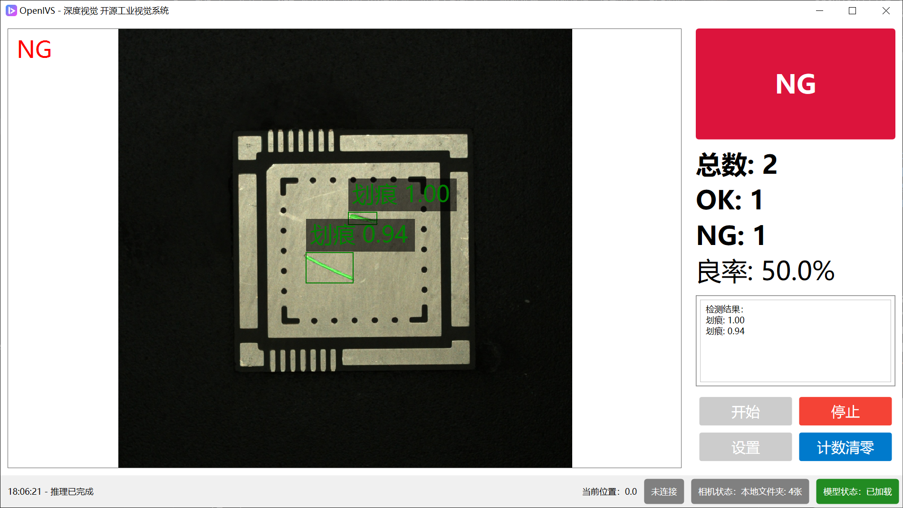
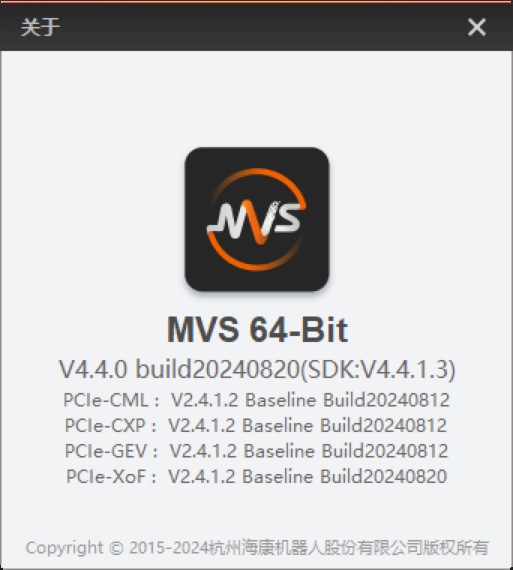
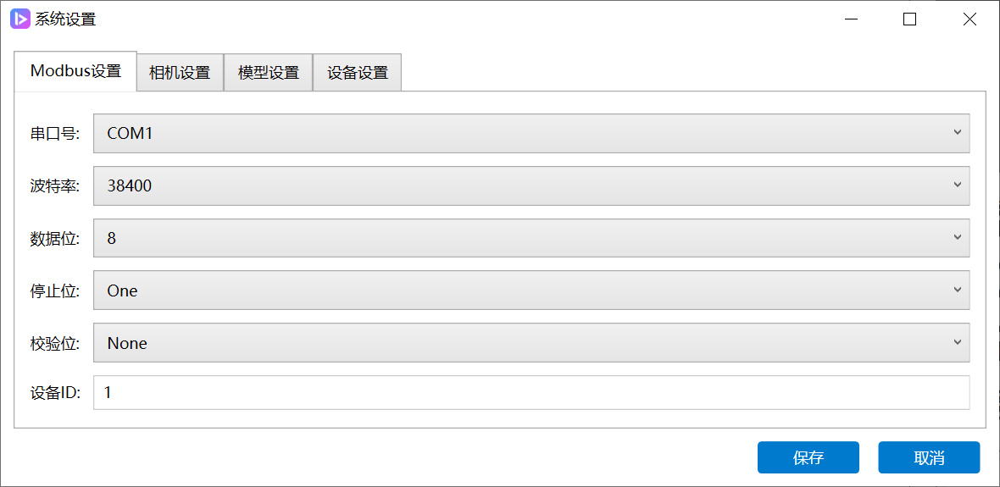
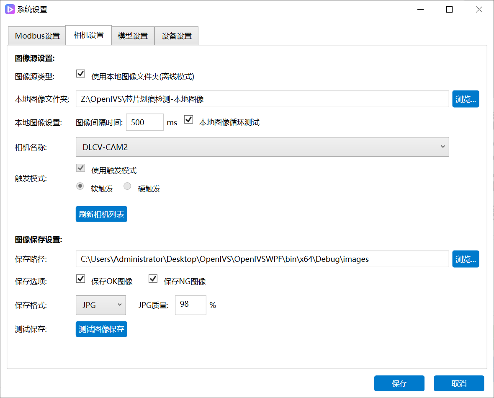
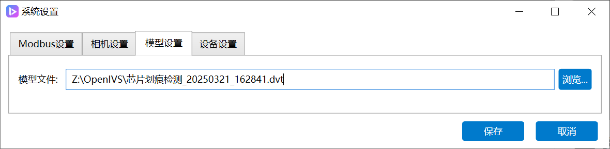
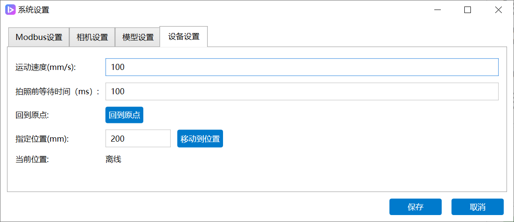

# OpenIVS 文档

<picture>
  <source media="(prefers-color-scheme: dark)" srcset="https://api.star-history.com/svg?repos=dl-cv/OpenIVS&type=Date&theme=dark" />
  <source media="(prefers-color-scheme: light)" srcset="https://api.star-history.com/svg?repos=dl-cv/OpenIVS&type=Date" />
  
</picture>

## 简介

OpenIVS 的全称是 Open Source Industrial Vision System，即开源工业视觉系统。它是一个开源的工业视觉软件框架，帮助你快速完成工业视觉检测项目。

OpenIVS 是一个基于 .NET 平台的工业视觉软件框架，提供了相机连接、图像采集、图像处理、模型推理、PLC控制等功能。你可以使用 OpenIVS 快速搭建一个工业视觉检测系统，实现自动化检测、缺陷识别等功能。



## 目录

- [安装需求](#安装需求)
- [使用说明](#使用说明)
  - [修改PLC配置](#修改plc配置)
  - [修改相机配置](#修改相机配置)
  - [修改模型推理方法](#修改模型推理方法)
  - [修改设备逻辑](#修改设备逻辑)

## 安装需求

在使用 OpenIVS 前，需要安装以下软件：

* **海康相机MVS**
  - 版本：MVS_STD_4.4.0_240913.exe
  - 下载地址：[https://www.hikrobotics.com/cn/machinevision/service/download/](https://www.hikrobotics.com/cn/machinevision/service/download/)
  - 用于相机连接和图像采集




常见问题：

如果没有安装MVS，则会出现找不到 MvCameraControl 的问题。

如果安装的不是 MVS，而是 机器视觉工业相机SDK ，则需要自行修改引用的 DLL 路径。

我们依赖的 MVS 的 DLL 路径是：C:\Program Files (x86)\MVS\Development\DotNet\win64\MvCameraControl.Net.dll

* **Halcon**（可选）
  - 版本：halcon-20.11.1.0-windows.exe
  - 下载地址：[https://www.mvtec.com/downloads](https://www.mvtec.com/downloads)
  - 如果需要使用Halcon接口进行图像处理，则需要安装

* **深度视觉AI平台**
  - 官方网站：[https://dlcv.com.cn](https://dlcv.com.cn)
  - 需要安装**高性能SDK套件**才能加载模型进行推理
  - 您需要使用深度视觉AI平台训练模型
  - 该SDK提供了模型推理所需的各项功能
  - 参考文档：[https://docs.dlcv.com.cn/deploy/sdk/csharp_sdk](https://docs.dlcv.com.cn/deploy/sdk/csharp_sdk)


## 使用说明

### 修改PLC配置

在 [ModbusManager.cs](OpenIVSWPF\Managers\ModbusManager.cs) 中可以修改PLC相关配置：

#### 串口通信参数设置

   ```csharp
   _modbusApi.SetSerialPort(
       settings.PortName,  // 串口名称
       settings.BaudRate,  // 波特率
       settings.DataBits,  // 数据位
       settings.StopBits,  // 停止位
       settings.Parity,    // 校验位
       (byte)settings.DeviceId   // 设备ID
   );
   ```

也可以在设置页面修改：



#### 位置控制参数
   - 修改`MoveToPositionAsync`方法可调整位置控制逻辑
   - 调整位置精度：`Math.Abs(currentPosition - position) < 1.0f`

#### 增加其他动作

可在`ModbusManager`中增加其他PLC控制动作，以满足特定需求。例如：增加 OK/NG 信号控制。

假设 PLC 通过写入寄存器 16 实现 OK/NG 信号控制，可以在`ModbusManager`中增加如下方法：

```csharp
_modbusApi.WriteSingleRegister(16, isOK);
```

### 修改相机配置

#### 修改相机配置

单相机的情况下，可以在设置页面修改，包括相机名称，触发方式等：



同时也可以在设置页面修改：

* 存图路径
* 存图质量
* 是否存储OK图或NG图

#### 多相机支持

多相机的情况下，可以在 [CameraInitializer.cs](OpenIVSWPF\Managers\CameraInitializer.cs) 中修改相机连接参数：

- 当前系统使用单例模式管理相机：`CameraInstance.Instance`
- 若需支持多相机，可修改为列表管理多个相机实例

```csharp
// 多相机管理示例
private List<CameraManager> _cameraManagers = new List<CameraManager>();

// 初始化多个相机
public void InitializeMultipleCameras(Settings settings)
{
      foreach (var cameraConfig in settings.CameraConfigs)
      {
         var cameraManager = new CameraManager();
         // 设置相机参数
         _cameraManagers.Add(cameraManager);
      }
}
```

### 修改模型推理方法

#### 设置模型路径

在设置页面，可以修改模型路径：



#### 自定义模型推理

在 [ModelManager.cs](OpenIVSWPF\Managers\ModelManager.cs) 中可以修改AI模型推理相关配置：

1. **加载多个模型**
   ```csharp
   // 多模型管理示例
   private Dictionary<string, Model> _models = new Dictionary<string, Model>();
   
   // 加载多个模型
   public void LoadModels(List<string> modelPaths)
   {
       foreach (var path in modelPaths)
       {
           string modelName = Path.GetFileNameWithoutExtension(path);
           _models[modelName] = new Model(path, 0);
       }
   }
   ```

2. **实现模型级联**
   - 可修改`PerformInference`方法实现多模型级联推理
   ```csharp
   // 级联推理示例
   public string PerformCascadeInference(Bitmap image)
   {
       // 第一阶段：检测
       var detectionResult = _models["DetModel"].InferBatch(imageList);
       
       // 第二阶段：分割
       var smallImages = CropImage(image, detectionResult);
       var segmentationResult = _models["SegModel"].InferBatch(smallImages);
       
       return segmentationResult;
   }
   ```

3. **自定义结果处理**
   - 可修改结果提取和处理逻辑，实现更复杂的决策规则

### 修改设备逻辑

简单的设备逻辑可以在设置里修改：



#### 自定义处理逻辑

在 [MainLoopManager.cs](OpenIVSWPF\Managers\MainLoopManager.cs) 中可以修改整体处理逻辑：

1. **修改位置序列**
   ```csharp
   // 位置序列定义可以根据需要调整
   private readonly float[] _positionSequence = new float[] { 195, 305, 415, 305 };
   ```

2. **调整处理流程**
   - 主流程在`RunMainLoopAsync`方法中定义
   - 可修改移动-拍照-推理的顺序或添加额外步骤

3. **添加图像预处理**
   - 在`ProcessImageAsync`方法中添加图像处理逻辑
   ```csharp
   // 图像预处理示例
   private Bitmap PreprocessImage(Bitmap image)
   {
       using (var mat = BitmapConverter.ToMat(image))
       {
           // 添加预处理步骤，如二值化等
           Cv2.CvtColor(mat, mat, ColorConversionCodes.BGR2GRAY);
           Cv2.Threshold(mat, mat, 128, 255, ThresholdTypes.Binary);
           
           return BitmapConverter.ToBitmap(mat);
       }
   }
   ```

4. **自定义后处理逻辑**
   - 在推理结果处理后添加自定义逻辑，如结果聚合、条件判断等
   ```csharp
   // 后处理逻辑示例
   private bool PostProcessResult(string result)
   {
       // 实现自定义决策逻辑
       if (result.Contains("缺陷") && _currentPositionIndex == 2)
       {
           // 特定位置的特定缺陷处理
           return false;
       }
       return string.IsNullOrEmpty(result);
   }
   ```

